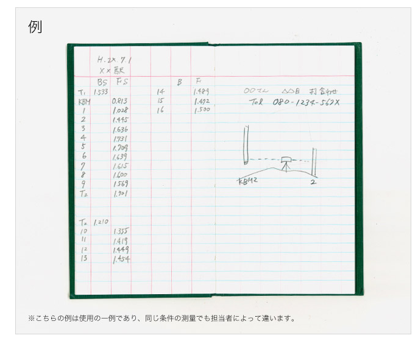
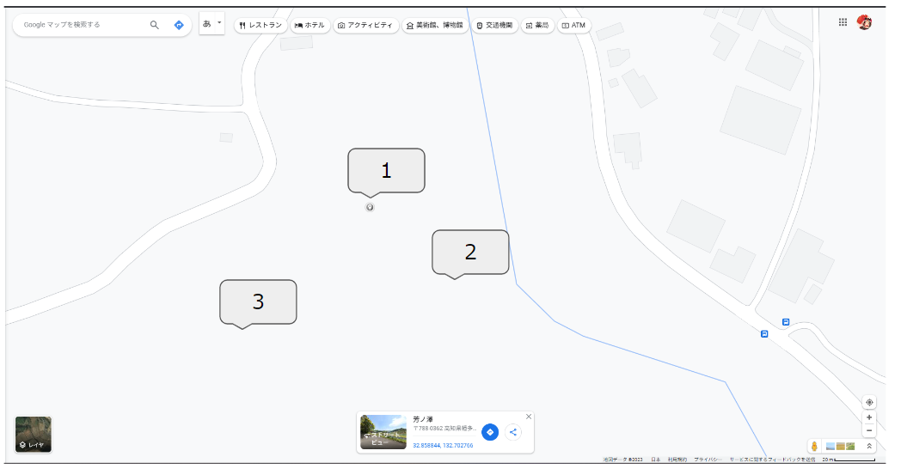

# surveying_app

for surveying

## 実装機能リスト

### surveying 測量
測量には複数あるが、まずは高さを計測する、水準測量の実装を予定。
現場では、下記のように「野帳」という手帳に記入し、計算して測定個所の高さを測定している。

1. 機械で目盛りを読む。
1. 読み取った数字を野帳に手書き。
1. 標尺（長い棒）を持ってる人に次の点に移動してもらい、その値を読む。
1. その値を野帳に記載し、先ほどとの数値差で、高低差を出し、高さを特定。


```
問題点
電卓で計算する頻度がかなり高い。
また、電卓で計算するまで、高さが間違っていることに気づけない。
結局、計算した結果を、かえってExcelとかにまとめてしまっているので、二度手間
```

```
メリット
自動計算で電卓が不要
紙での記載がいらない。
Excelに連携できるようにCSVファイル出力を可能にする
```

[写真参考](https://www.kokuyo-st.co.jp/stationery/fieldnote/howto/)

### 経費計算
現場でかかるお金を一括で管理する。
明細を写真で管理して、PDFに出力できるようにする
例
- ガソリン代
- 駐車場代など

### 地図に写真を落とし込むアプリ

1. 現場で写真を撮影　GPS機能により写真と座標を紐づける
1. そのデータを保存（ローカル、もしくは、クラウドかは要検討）
1. すると、下記イメージのように、アプリ内で番号付き吹き出しが表示される
1. クリックすると、その撮影した写真が見れる

イメージ



https://docs.google.com/presentation/d/1dn1KPM2g_FkbpsWe0QHkJ7rD3TzVsx_hTL99YhDHfjk/edit?usp=drive_link


## 参考サイト

[DB接続の参考サイト](https://yakiimosan.com/flutter-sqlite-basic/#index_id0)


[複数のTextEditingControllerを作成する方法](https://zenn.dev/akinori25/articles/801c24178e782c)

[textFieldの値を扱う](https://minoru-maru.com/%E3%80%90flutter%E3%80%91%E3%83%86%E3%82%AD%E3%82%B9%E3%83%88%E3%83%9C%E3%83%83%E3%82%AF%E3%82%B9%E3%81%AB%E5%85%A5%E5%8A%9B%E3%81%95%E3%82%8C%E3%81%9F%E6%96%87%E5%AD%97%E5%88%97%E3%82%92%E6%89%B1/)
[flutter初期ソースの説明](https://qiita.com/naoaki_kaito/items/ed77ee085ad61f951784)


[ToDo画面作成](https://qiita.com/t_k_t/items/29848ac897e159030843)

[Javaのコンストラクタについて](https://www.javadrive.jp/start/extends/index4.html)
